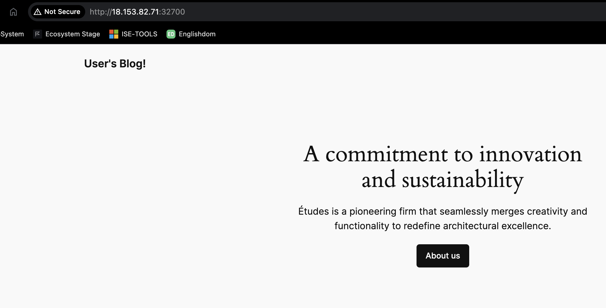
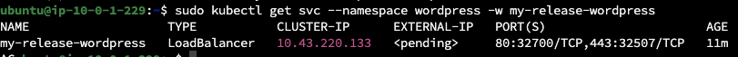

# Task 5: Simple Application Deployment with Helm

## Submission

- Provide a PR with the application and Helm chart in a new repository.
- Ensure that the application is accessible from the internet.
- Provide a PR with the CI/CD pipeline code for the application deployment.
- Provide a README file documenting the application setup and deployment process.

## Evaluation Criteria (100 points for covering all criteria)

1. **Helm Chart Creation (40 points)**

   - A Helm chart for the WordPress application is created.
   **Answer**: all variables in wordpress-values.yaml file. Use exist charts as i understand [Git](https://github.com/bitnami/charts/tree/main/bitnami/wordpress)  

2. **Application Deployment (30 points)**

   - The application is deployed using the Helm chart.
   **Answer**: After  some time two pods are running state  
    
   - The application is accessible from the internet.  
   **Answer**: Yes, over custom port 32700. Don't know why k3s restricted ports  
     

3. **Repository Submission (5 points)**

   - A new repository is created with the WordPress and Helm chart.
   **Answer**: Do not use separate repo for this task. Make all in one Repository

4. **Verification (5 points)**

   - The application is verified to be running and accessible.
   **Answer**: I did not check site features, but still have access after i see that Loadbalance is up  
   

5. **Additional Tasks (20 points)**
   - **CI/CD Pipeline (10 points)**
     - A CI/CD pipeline is set up to automate the deployment of the application.
     **Answer**: Mopstly use ssh connection and does same thing that i did manualy in EC2 console.
   - **Documentation (10 points)**
     - The application setup and deployment process are documented in a README file