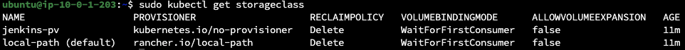

## Evaluation Criteria (100 points for covering all criteria)
I was doing setup by https://www.jenkins.io/doc/book/installing/kubernetes/#install-jenkins-with-helm-v3. 
But after jenkins start in goes to ERROR state  
In logs fail in apply_config.sh  
sudo kubectl describe pod jenkins-0 -n jenkins
```
Container ID:  containerd://b6511a65fa77587247a3224439f2a383b40f4117e569b5a1ad55bbb66a4ec083
    Image:         docker.io/jenkins/jenkins:2.479.1-jdk17
    Image ID:      docker.io/jenkins/jenkins@sha256:7ea4989040ce0840129937b339bf8c8f878c14b08991def312bdf51ca05aa358
    Port:          <none>
    Host Port:     <none>
    Command:
      sh
      /var/jenkins_config/apply_config.sh
    State:          Terminated
      Reason:       Error
      Exit Code:    2
      Started:      Fri, 08 Nov 2024 12:32:53 +0000
      Finished:     Fri, 08 Nov 2024 12:32:53 +0000
    Last State:     Terminated
      Reason:       Error
      Exit Code:    2
      Started:      Fri, 08 Nov 2024 12:32:30 +0000
      Finished:     Fri, 08 Nov 2024 12:32:30 +0000
    Ready:          False
    Restart Count:  3
    Limits:
      cpu:     2
      memory:  4Gi
    Requests:
      cpu:        50m
      memory:     256Mi
    Environment:  <none>
```

1. **Helm Installation and Verification (10 points)**

   - Helm is installed and verified by deploying the Nginx chart.


2. **Cluster Requirements (10 points)**

   - The cluster has a solution for managing persistent volumes (PV) and persistent volume claims (PVC).
   kubectl apply PVC is creating a storageclass.
   

3. **Jenkins Installation (50 points)**

   - Jenkins is installed using Helm in a separate namespace.
   **Answer**: i Have name space jenkins but the Jenkins by itself goes to Error State, so its not done
   - Jenkins is available from the internet.

4. **Jenkins Configuration (10 points)**

   - Jenkins configuration is stored on a persistent volume and is not lost when Jenkins' pod is terminated.
   **Answer**: Becouse i do not have running Jenkins there is no configs in PV

5. **Verification (10 points)**

   - A simple Jenkins freestyle project is created and runs successfully, writing "Hello world" into the log.

6. **Additional Tasks (10 points)**
   - **GitHub Actions (GHA) Pipeline (5 points)**
     - A GHA pipeline is set up to deploy Jenkins.
   - **Authentication and Security (5 points)**
     - Authentication and security settings are configured for Jenkins.