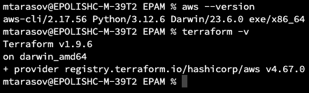
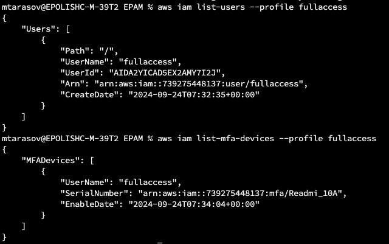
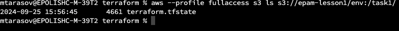
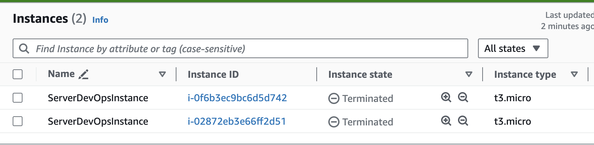

# rsschool-devops-course-tasks
1.Install AWS CLI and Terraform



2.Create IAM User and Configure MFA



3.Configure AWS CLI

Can run previous commands from cli to get info from AWS.

4.Create a Github repository for your Terraform code

My repository  [link](https://github.com/NikStormov/rsschool-devops-course-tasks)
Give access to all repo in Role ("repo:NikStormov/*"), becouse action can't give access from pr. 
5.Create a bucket for Terraform states
```
Use ARN env
```
saved in github for terraform and aws as secret.

8.Create a Github Actions workflow for deployment via Terraform

For s3 backend, its create a file state.


And creates a instans



More about Terraform backend i get from [Terraform S3](https://developer.hashicorp.com/terraform/language/backend/s3) documen

Answers about how to connect terraform to s3 aws [what env its needed](https://docs.aws.amazon.com/sdkref/latest/guide/feature-static-credentials.html) to auth

