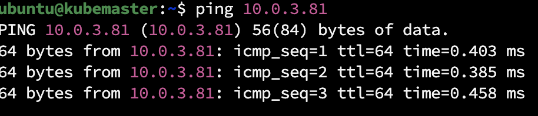
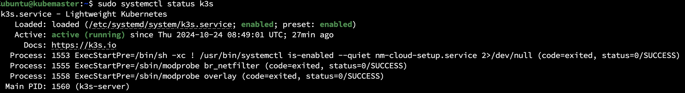
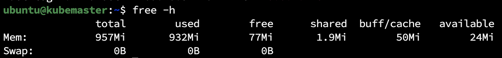
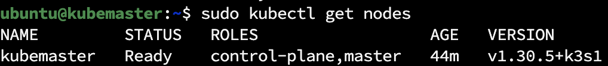
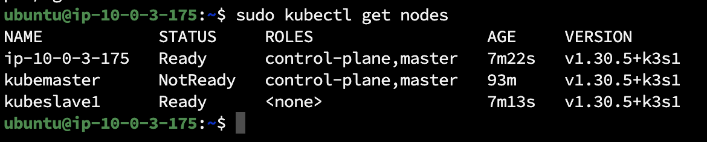
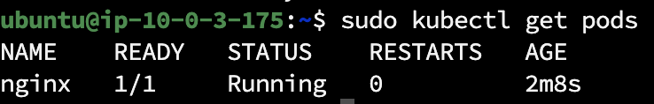

# Task: K8s Cluster Configuration and Creation

## Objective

In this task, configure and deploy a Kubernetes (K8s) cluster on AWS using either kOps or k3s. Also verify the cluster by running a simple workload.

## Submission

- Provide a PR with the Terraform code for the K8s cluster and bastion host.
**Answer**: Terrafor code for two instanses in private network and one is bastion in two files. 
  - [\[x\] bastion.tf](./terraform/bastion.tf)
  - [\[x\] kube_instans.tf](./terraform/kube_instans.tf)
- Provide a screenshot of the `kubectl get nodes` command output.
- Ensure that the simple workload is deployed and running successfully on the cluster.
- Provide a PR with the monitoring setup.
- Provide a README file documenting the cluster setup and deployment process.

## Evaluation Criteria (100 points for covering all criteria)

1. **Terraform Code for AWS Resources (10 points)**

   - Terraform code is created or extended to manage AWS resources required for the cluster creation.
   **Answer**: Used task 2 infra, create two instans as master and slave
   - The code includes the creation of a bastion host.
   **Answer**: For conection i create ssh key and save in in local dir, for other EC2 i added id_rsa.pub(key_name) to authorized file.

2. **Cluster Deployment (60 points)**

   - A K8s cluster is deployed using either kOps or k3s.
   **Answer**: I gonna use k3s, pros is simple to me.
   Did all configs by using k3s fast-deploy https://docs.k3s.io/quick-start
   hostnames for instanses i change manualy
   Use their scripts to start k3s on master, then get the ```/var/lib/rancher/k3s/server/node-token``` for connect agent - kubeslave1. 
   From Bastion ssh , using same ssh-key, to kubeslave1 and connect it ```curl -sfL https://get.k3s.io | K3S_URL=https://10.0.1.228:6443 ```. 
   And then i get a problem connectin them together: 
   Master and slave in one private network, can access each other.
   
   k3s demon is working and kubectl is working.
   
   Maybe its becouse of lack of memory
   

3. **Cluster Verification (10 points)**

   - The cluster is verified by running the `kubectl get nodes` command from the local computer.
   - A screenshot of the `kubectl get nodes` command output is provided.
   **Answer**: 
   

4. **Workload Deployment (10 points)**

   - A simple workload is deployed on the cluster using `kubectl apply -f https://k8s.io/examples/pods/simple-pod.yaml`.
   - The workload runs successfully on the cluster.
   **Answer**: I got 3 nodes, two was planed Node - ubuntu@ip-10-0-3-175 creater after instans reboot. 
   
   Pode nginx is created
   


5. **Additional Tasks (10 points)**
   - Document the cluster setup and deployment process in a README file.
    - [\[x\] README](./README.md)