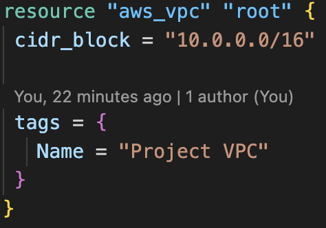
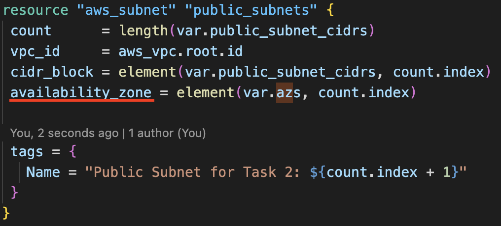
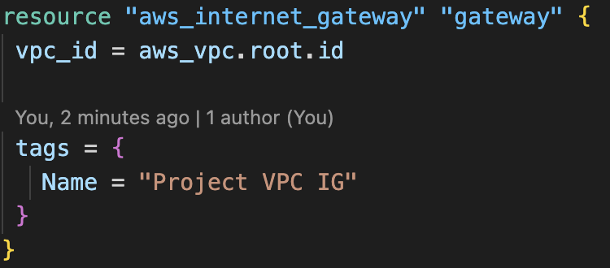

# rsschool-devops-course-tasks
## Basic Infrastructure Configuration Review
## Objective

In this task, you will write Terraform code to configure the basic networking infrastructure required for a Kubernetes (K8s) cluster.

## Evaluation Criteria (100 points for covering all criteria)

1. **Terraform Code Implementation (50 points)**

   - Terraform code is created to configure the following:
     - VPC:
     
     - 2 public subnets in different AZs:
     by using "element" i can define one resource and cofigure as many as elements it has
     
     - 2 private subnets in different AZs: goes same as public networks.
     - Internet Gateway
     
     - Routing configuration:
       - Instances in all subnets can reach each other
       - Instances in public subnets can reach addresses outside VPC and vice-versa

2. **Code Organization (10 points)**

   - Variables are defined in a separate variables file.  
    [\[x\] variables](./terraform/variables.tf)
   - Resources are separated into different files for better organization.  
    [\[x\] resource_network.tf](./terraform/resource_network.tf)  
    [\[x\] policy.tf](./terraform/policy.tf)  
    [\[x\] ec2.tf](./terraform/ec2.tf)  

3. **Verification (10 points)**

   - Terraform plan is executed successfully.
   - A resource map screenshot is provided (VPC -> Your VPCs -> your_VPC_name -> Resource map).

4. **Additional Tasks (30 points)**
   - **Security Groups and Network ACLs (5 points)**
     - Implement security groups and network ACLs for the VPC and subnets.  
     Group "http" is for networks allowing 80 port, group "ec2" is for instanses.  
    [\[x\] security.tf](./terraform/security.tf)  
   - **Bastion Host (5 points)**
     - Create a bastion host for secure access to the private subnets.
     Created bastion in first private network.  
     [\[x\] ec2.tf](./terraform/ec2.tf)
   - **NAT is implemented for private subnets (10 points)**
     - Orginize NAT for private subnets with simpler or cheaper way  
     Used simple way
     - Instances in private subnets should be able to reach addresses outside VPC  
     bastion has private network and using the default gateway (resource aws_internet_gateway that we connected to resource "aws_route_table" "private_subnet_route")  
     [\[x\] resource_network.tf](./terraform/resource_network.tf) 
     [bastion_network](./images/task2/bastion_private.png)
   - **Documentation (5 points)**
     - Document the infrastructure setup and usage in a README file.
   - **Submission (5 points)**
   - A GitHub Actions (GHA) pipeline is set up for the Terraform code.